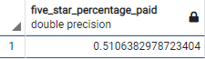

# Amazon Vine Analysis

## Overview

### Purpose
The purpose is to analyze amazon reviews written by members of the Vine Program, a service that allows manufacturers and publishers to receive reviews for their products. I have picked reviews from the video game category to analyze.

## Results
Count of Vine Reviews  

Count of non-Vine reviews  

* There are 40,471 Reviews not part of the Vine program
* There are much less reviews of 94 reviews from the Vine program

Count of Vine 5-star Reviews  

Count of non-Vine 5-star reviews  

* There are 48 5-star reviews for paid users
* There are 15,663 5-star reviews from unpoaid users

Vine 5-star Reviews percentage  

non-Vine 5-star reviews percentage  

* about 51% of Vine reviews are 5-stars
* about 39% of non-Vine reviews are 5-stars

## Summary
According to the data, there are far more reviews from people that are not part of the vine program. This makes sense due to the fact that Vine reviews receive the product for free and are meant to provide initial reviews for the items in question. One thing to note though is that there are noticeably a higher percentage of Reviewers that provided a 5-star review from the Vine Reviews compared to the Reviews not from the Vine program. This may be due to multiple reasons
* There are far more unpaid reviews so the accuracy of the quality of the product may be higher
* the Vine users may be more lenient or biased due to receiving the product for free
